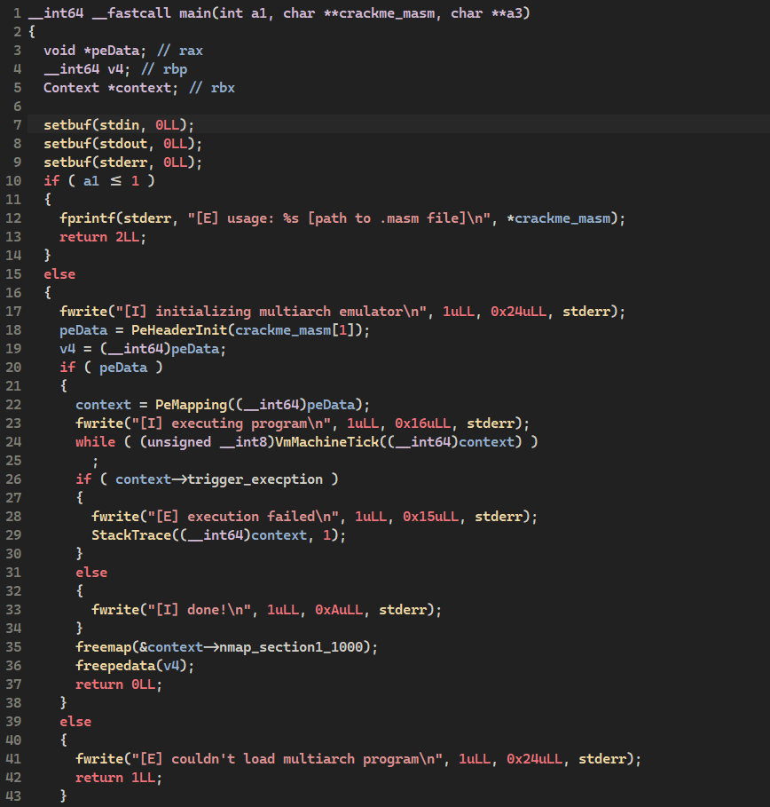
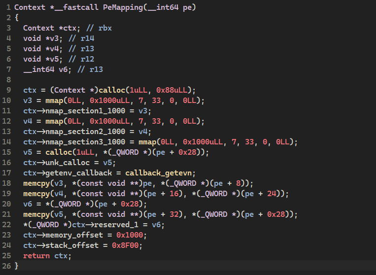
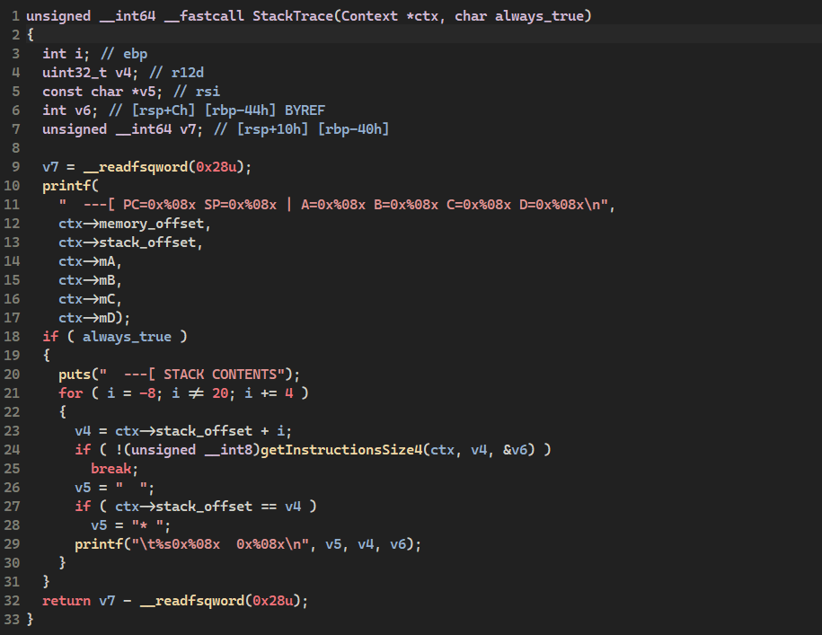
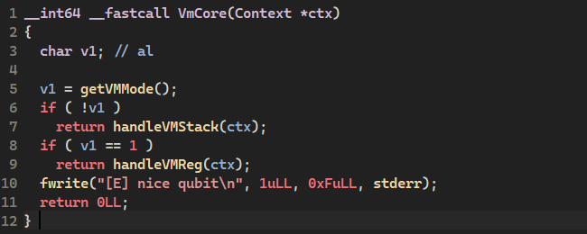
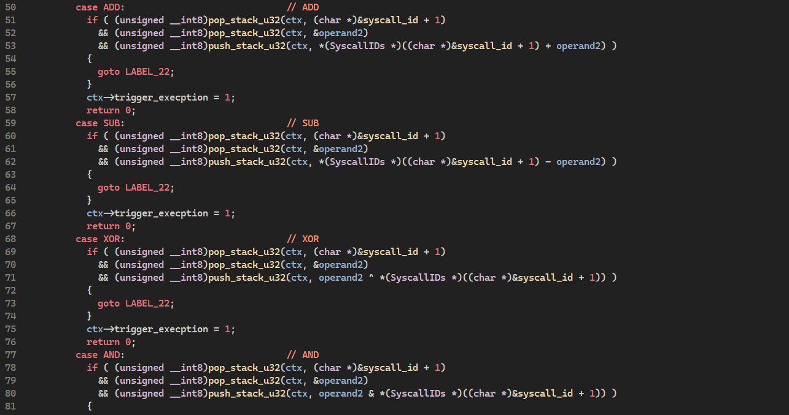
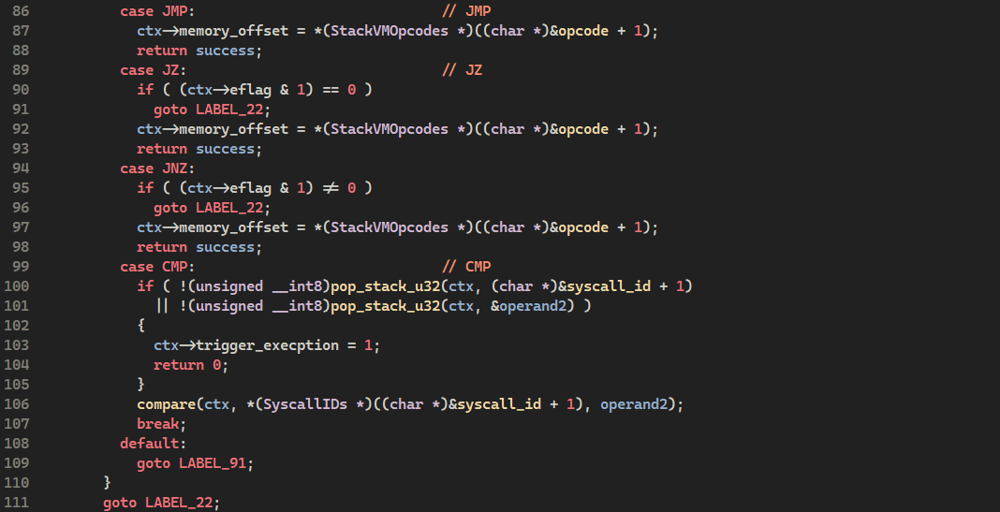
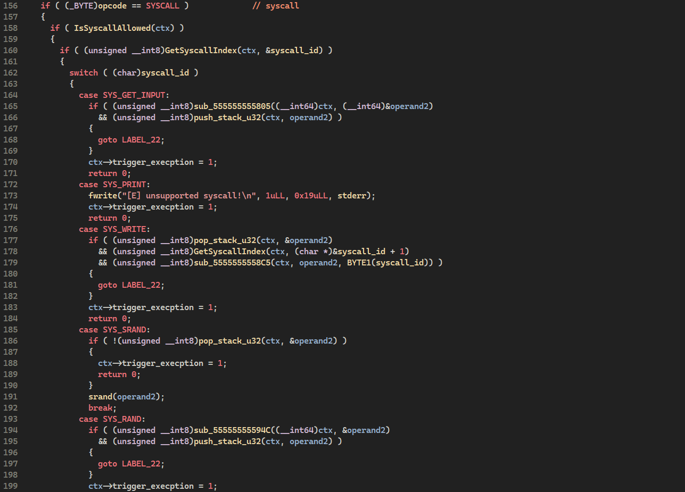
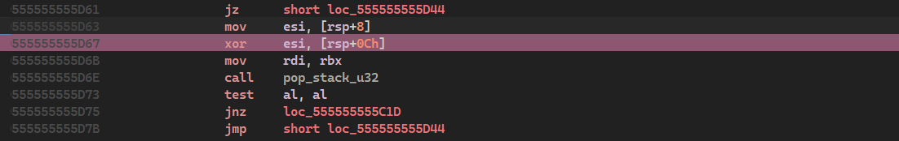
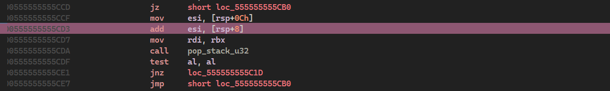
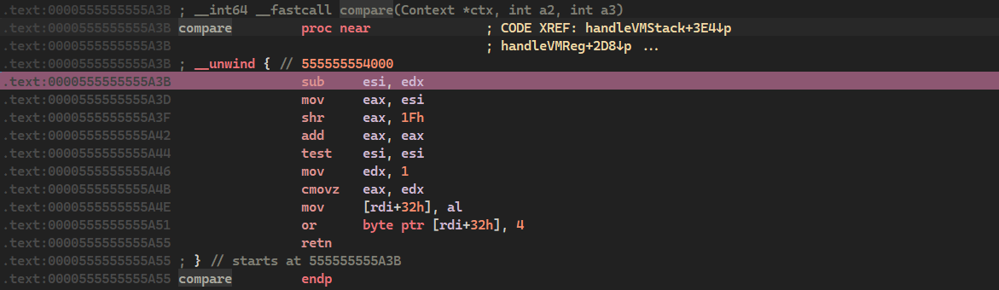

# MULTIARCH-1

## Category: Reverse Engineering • Points: 126


## Description:
### *Stacks are fun, registers are easy, but why do one when you can do both? Welcome to the multiarch.*
---
## Begin:

We are given two main files: **multiarch** and **crackme.masm**. The first one is a virtual machine for Linux, while the second is an PE binary. 
**The task is to run the binary and answer 3 questions**, after which we will receive the flag.
Let's start with static analysis of the VM.

---

## VM Analysis

The virtual machine itself is quite simple and easily analyzable. After a brief analysis, we have the following **main** function:



Functions we pay attention to right away:

### **PeMapping**



Analyzing this function and the not mentioned PeHeaderInit function, we assemble most of the VM execution context structure. We obtain the remaining information from the StackTrace function, which kindly provides us with the registers being used.



So, what we have is:

```cpp
struct Context
{
    void *nmap_section1_1000;      // Memory mapped section 1
    void *nmap_section2_1000;      // Memory mapped section 2  
    void *nmap_section3_1000;      // Memory mapped section 3
    void *unk_calloc;              // Size???
    char reserved_1[8];            
    void *getenv_callback;
    bool trigger_exception;        // Exception trigger flag
    bool permission_syscall;       // Syscall permission flag
    uint8_t eflag;                 // Flags register for conditional jumps (like x86 EFLAGS)
    uint32_t memory_offset;        // Memory offset
    uint32_t stack_offset;         // Stack offset
    uint32_t mA;                   // Register A
    uint32_t mB;                   // Register B
    uint32_t mC;                   // Register C
    uint32_t mD;                   // Register D
};
```

The structure gave us enough information to work further. Let's move directly to the core of the VM.



What we see after opening the function above is two handlers. Later we learn that one serves to handle operations with stack data, while the other handles registers. Moving on to the most interesting part - finding out which opcode is responsible for which operation. I'll quickly go through with screenshots, otherwise this review may drag on too long.

## Opcodes Analysis

The basic operators, jumps and syscalls for the first handler (rsp) look something like this:







Same and some other new operations exist in the second handler (reg), there are some differences though. Here are the enums for both handlers:

### Stack VM Opcodes:
```cpp
enum StackVMOpcodes
{
    S_LDB = 0x10,
    S_LDW = 0x20,
    PUSH_STACK = 0x30,
    S_LDP = 0x40,
    POP_STACK = 0x50,
    ADD = 0x60,
    SUB = 0x61,
    XOR = 0x62,
    AND = 0x63,
    JMP = 0x70,
    JZ = 0x71,
    JNZ = 0x72,
    CMP = 0x80,
    SYSCALL = 0xA0,
    S_HLT = 0xFF,
};

```
### Register VM Opcodes:
```cpp
enum RegVMOpcodes
{
    REG_HALT = 0x0,
    REG_SYSCALL = 0x1,
    REG_PUSH = 0x10,
    PUSH_REG0 = 0x11,
    PUSH_REG1 = 0x12,
    PUSH_REG2 = 0x13,
    PUSH_REG3 = 0x14,
    POP_REG0 = 0x15,
    POP_REG1 = 0x16,
    POP_REG2 = 0x17,
    POP_REG3 = 0x18,
    ADD_REG = 0x20,
    ADD_IMM = 0x21,
    SUB_REG = 0x30,
    SUB_IMM = 0x31,
    XOR_REG = 0x40,
    XOR_IMM = 0x41,
    MUL_REG = 0x50,
    MUL_IMM = 0x51,
    JMP_ABS = 0x60,
    CALL = 0x61,
    JZ_REG = 0x62,
    JNZ_REG = 0x63,
    JMP_FLAG2 = 0x64,
    JMP_IMM = 0x68,
};

```

### System Call IDs:
```cpp
enum SyscallIDs
{
    SYS_GET_INPUT = 0x0,
    SYS_PRINT = 0x1,
    SYS_WRITE = 0x2,
    SYS_SRAND = 0x3,
    SYS_RAND = 0x4,
    SYS_FLAG = 0x5,
    SYS_MALLOC = 0x6,
};
```

Knowing how our VM works, we can proceed to dynamic analysis. We set breakpoints on all opcodes and start watching calls chain. Then we skip the full trace chain and focuse only on the main operations of the task.

## Challenge 1 - What's your favorite number?

The first thing we face here is the XOR instruction in the first handler:

We check what we have in operands:
- **Operand 1:** `0x8675309`
- **Operand 2:** `0x13370539`
- **Result:** `0x1B505630`

We note this and move on.



The next opcode is ADD. Looking at the operands, we can see how the XOR result is added to our number: `0x1B505630 + (we entered 123321)`. We note this again and continue execution.



Next we immediately hit the CMP opcode where our number `0x1B5237E9` is compared with the reference value `0xAAAAAAAA`, which immediately results in setting `trigger_exception = true` and exiting the program.



Repeating the experiment, we can see that the first operation is constant and always equals `0x1B505630`. Now we can fully see the algorithm for checking our number:

```cpp
bool challenge1(uint32_t value)
{
    uint32_t r1 = 0x1B505630; // 0x8675309 ^ 0x13370539;
    uint32_t r2 = r1 + value;
    
    if (r2 == 0xAAAAAAAA)
    {
        return true;
    }

    return false;
}
```

Now we simply subtract the XOR result from the reference number and get `0x8F5A547A`. This is the correct answer!

```cpp
0xAAAAAAAA - 0x1B505630 = 0x8F5A547A; // (2405061754)
```

---

## Challenge 2 - Tell me a joke:

Let's simplify our chain. I'll just describe the order of actions with the reference value and give you pseudocode with the answer.

**Algorithm steps:**
1. Multiply `0xCAFEBABE` (constant) by our ASCII symbols using MUL_IMM instruction
2. Place our resulting value in register A
3. Truncate and place the result using `>> 0x20` (constant) in register D
4. Execute bitwise XOR operation on B and D (B equals 0, value is also constant)
5. Execute this algorithm 7 times
6. Check with reference value using CMP

A fairly simple algorithm. Here's the pseudocode:

```cpp
bool challenge2(uint32_t hex_symbol)
{
    uint32_t A{};
    uint64_t D{};
    uint64_t B{};

    for (int i = 0; i < 7; i++)
    {
        uint32_t A = 0xCAFEBABE * hex_symbol;
        
        D = A >> 0x20;
        B = B ^ D;
    }
    
    if (B == expected_value)
    {
        return true;
    }
    
    return false;
}
```

The logic is quite simple and clear. We need to get a number that will start with the reference number `0x7331` when multiplied by `0xCAFEBABE` (we don't care about the further values, they will be truncated by `>> 0x20`).

We don't pay attention to XOR at all since after 7th iteration we will return our resulting number. Let's write a parser!

```javascript
// nodejs
for (let i = 0; i <= 0x10FFF; i++) {
    const result = i * 0xCAFEBABE;
    const pair_hex = i.toString(16).toUpperCase().padStart(4, '0');
    const result_hex = result.toString(16).toUpperCase();
    
    if (resultHex.startsWith('7331')) 
    {
        console.log(`${pairHex}: ${resultHex || '0'}`);
    }
}
```

**Result:** `9146: 7331C96CADF4`

Excellent! This number fits us well - in ASCII it's **'F''**, which is exactly `0x4691`. We enter the answer and move on...

## Challenge 3 - Almost there! But can you predict the future? What number am I thinking of?

In the next challenge there are similar operations but with two syscalls **SRAND** and **RAND** added. We also trace the execution process and gradually write the pseudocode:

```cpp
uint32_t challenge3(uint32_t value)
{
    srand(value);

    for (int i = 0; i < 10; i++)
    {
        uint32_t val = rand();
        val |= rand() << 16;

        uint32_t r1 = 0x133700 ^ val;
        uint32_t r2 = r1 ^ 0xF2F2F2F2;
        uint32_t r3 = r2 & 0xFFFFFF;

        if (r3 == 0xC0FFEE)
        {
            return true;
        } 
    }

    return false;
}
```

After analyzing the result, we simply run the following code and watch which values pass the condition:

```cpp
int main()
{
    for (uint32_t i = 0; i < 0xffffffff; i++)
    {
        if (challenge3(i))
        {
          std::cout << "Found value: " << i << "\n";
        }
    }
    std::cout << "Hello World!\n";
}
```

At this stage we face a small difficulty - the code seems to be correct and everything should work properly, but this parser still gives the wrong answer on Windows. If we just move to Linux, we will finally get the needed value `0x155A18`. Most likely this happens due to differences in how the srand-rand functions work, but we don't bother to investigate this :)


## MULTIARCH-1 CTF Challenge Answers

| Challenge | Question | Answer | Hex Value |
|-----------|----------|--------|-----------|
| **Challenge 1** | What's your favorite number? | **2405061754** | `0x8F5A547A` |
| **Challenge 2** | Tell me a joke: | **F'** | `0x4691` (ASCII) |
| **Challenge 3** | Almost there! But can you predict the future? What number am I thinking of? | **1399320** | `0x155A18` |

## Solution Methods

| Challenge | Method | Key Formula/Logic |
|-----------|--------|-------------------|
| **Challenge 1** | Simple arithmetic | `0xAAAAAAAA - 0x1B505630 = 0x8F5A547A` |
| **Challenge 2** | Brute force search | Find ASCII 2 chars where `(0x4691 * 0xCAFEBABE) >> 0x20` starts with `0x7331` |
| **Challenge 3** | Brute force with PRNG | Test srand() seeds until rand() sequence produces `0xC0FFEE` |


## Conclusion:

In this write-up I didn't mention some nuances of the VM operation as it would make quite a lot of text. I also skipped some description of dynamic analysis - most actions are similar within challenges and there's no point in elaborating on them. 

If you're reading this and you have spotted any mistake - feel free to notice me as mistakes are a part of learning and development!
